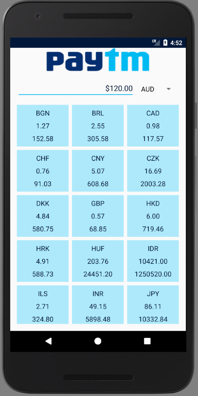
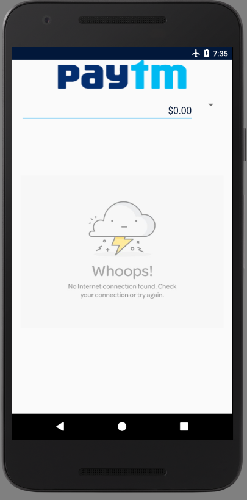
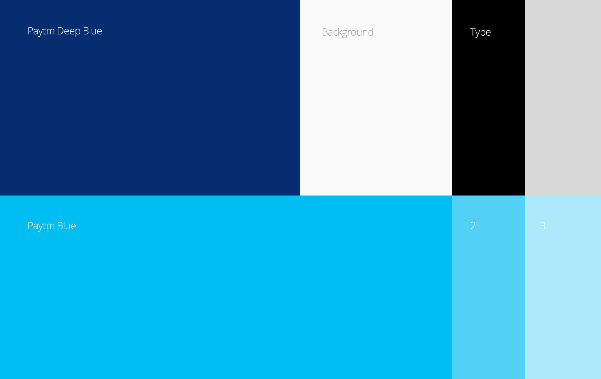
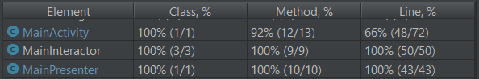

# Paytmlabs

## Project Objective

Develop a Currency Conversion App to show my coding style, some good practices and how I usually structure an Android app.

The result of the project is a fully functional app, with good UI, good code coverage and structured in a MVP pattern.

I hope the result of the work can express the knowledge I have on Android development.

To make it easier to reviewers, the APK can be downloaded from this link: [paytm-challenge.apk](APK/paytm-challenge.apk)

Below, I explain the project in more details.

## How functional requirements were implemented

### Exchange rates must be fetched from: http://fixer.io/

Retrofit was used to create a FixerApiService.

Some snippets of code on how this was implemented:
```java
public interface FixerAPIService {

    /* Get default exchange rates - EUR used as default at Fixer */
    @GET("/latest")
    Call<Latest> defaultExchangeRates();

    /* Use a different exchange rate as the base. Ex: USD */
    @GET("/latest")
    Call<Latest> differentBaseExchangeRates(@Query("base") String base);

}
```

```
API_URL = "https://api.fixer.io"

Retrofit retrofit = new Retrofit.Builder()
        .addConverterFactory(GsonConverterFactory.create())
        .baseUrl(API_URL)
        .client(okHttpClient)
        .build();
```

And finally:
```
return retrofit.create(FixerAPIService.class);
```

### User must be able to select a currency from a list of currencies available from Fixer

Using the code above, the currency list available from Fixer was obtained using `Call<Latest> defaultExchangeRates();`

After fetching the data and creating a `String[] items` list, I added this list to a spinner with the following snipped:

```
ArrayAdapter<String> adapter = new ArrayAdapter<String>(this,
                android.R.layout.simple_spinner_dropdown_item, items);

adapter.setDropDownViewResource(android.R.layout.simple_spinner_dropdown_item);
spinnerCurrency.setAdapter(adapter);
spinnerCurrency.setOnItemSelectedListener(this);
```

This way, the user could select the currency from a list showed on a spinner.

### User should then see a list of exchange rates for the selected currency

After selecting a currency on the spinner, the view notifies that the exchange rates list should be refreshed with
the new base currency.

The method `Call<Latest> differentBaseExchangeRates(@Query("base") String base);` is now called to retrieve the
exchange rates based on the currency of interest.

If the method returns successfully, the adapter that holds the grid items data is updated and refreshed.

```
exchangeAdapterData.setExchangeMap(exchangeRates);
if (mainView != null) {
   mainView.updateExchangeRatesList();
}
```

### Rates should be persisted locally and refreshed no more frequently than every 30 minutes (to limit bandwidth usage)

To achieve this refresh time, a cache and an interceptor were created to be used on the okhttpclient.
The cache persists the information locally, while the interceptor rewrites the response headers
to reconfigure the `Cache-Control` to a `max-age value of 60 * 30`. This will tell the client to use
the cache response, `not consuming bandwidth`, if the last message was received less then 30 minutes ago.

Some snippets on how it was done:
```
public static final int MAX_ONLINE_CACHE_TIME = 60 * 30; // 30 min tolerance
public static final int MAX_OFFLINE_CACHE_TIME = 60 * 60 * 24; // 1 day tolerance
public static final int MAX_CACHE_SIZE = 10 * 1024 * 1024; // 10 MB

Cache cache = new Cache(application.getCacheDir(), MAX_CACHE_SIZE);

Interceptor interceptor = new Interceptor() {
            @Override
            public Response intercept(Chain chain) throws IOException {
                okhttp3.Response originalResponse = chain.proceed(chain.request());
                if (NetworkStatus.isNetworkAvailable(application)) {
                    int maxAge = MAX_ONLINE_CACHE_TIME; // read from cache for 1 minute - time in seconds
                    return originalResponse.newBuilder()
                            .header("cache-control", "public, max-age=" + maxAge)
                            .build();
                } else {
                    int maxStale = MAX_OFFLINE_CACHE_TIME; // tolerate 1 day stale
                    return originalResponse.newBuilder()
                            .header("cache-control", "public, only-if-cached, max-stale=" + maxStale)
                            .build();
                }
            }
        };
```

And finally:
```
OkHttpClient client = new OkHttpClient
        .Builder()
        .cache(cache)
        .addNetworkInterceptor(interceptor)
        .build();
```

> Note that a better way to achieve the same rate os refresh would be configuring better the server side to send the correct
> header. Since this was not possible in this case, I used the interceptor for the purpose of showing how it can be done.

## App design

The UI of the app was inspired on Paytm's Visual Identity document that I found on this link: [Paytm Visual Identity](http://liquiddesigns.in/project/paytm-visual-identity-design/)

Some app screenshots to give you a taste:





Pallet based on the figure below:



## MVP Architecture

The MVP Architecture was used in this project. It is widely used nowadays for Android projects and it helps
a lot to make the code more extensible, maintainable and testable.

Because of the nature of the project and its size, the core components are basically 3: **MainActivity, MainPresenter and MainInteractor**
And the MVP interfaces can be found in [MainMVP.java](app/src/main/java/com/example/bmoreira/paytmchallenge/MainMVP.java)

## Tests and Coverage

The frameworks used for the tests were: **Mockito, Robolectric, Espresso**

Again, because of the nature of the project and its size, the focus on the tests were on the main components.

Here is a screenshot showing the Unit Tests coverage on these components:



I implemented both JUnit and Instrumented tests.

For example, the portion of the MainActivity that were not covered on the Unit tests are implemented as instrumented tests.

## Version Control

**GIT** + Github were extensively used during the development of this app.

Although I use Git Flow in a regular basis, I did not used it in this project because of the projects nature.

## Dependencies

| Dependencie        | Description           |
| ------------- |:-------------:|
| JUnit    | For the Unit tests |
| Mockito      | To Mock objects on tests |
| Robolectric | To Mock Android SDK dependencies on Unit tests |
| Espresso | To run Instrumented tests |
| Retrofit | Used as the HTTP Client to reach the Fixer API |
| Gson | To manipulate JSON objects returned by the Fixer API |
| ButterKnife | To easily bind views to objects and remove boilerplate code |
| Dagger 2 | Dependency Injection Framework |

## CheckStyle

Using Checkstyle to help maintenance of coding standard

The basic checkstyle configuration used in this project can be found here [paytm_checkstyle.xml](checkstyle/paytm_checkstyle.xml)

To run the checkstyle, you can either use the Android Studio Plugin, or run the gradle task, as follow:

```
gradlew checkstyle
```